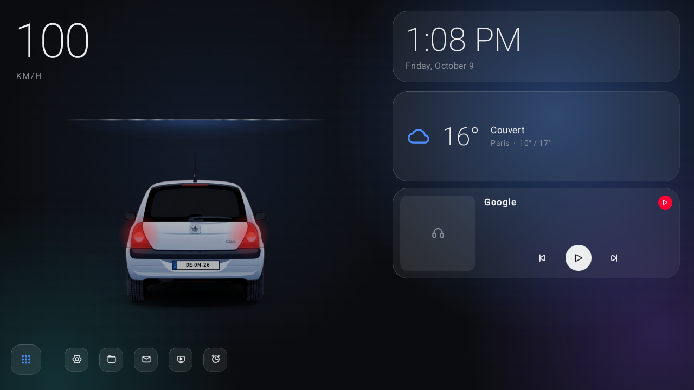
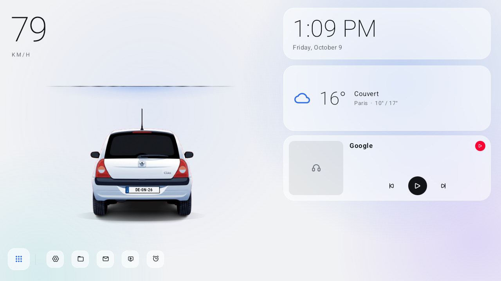
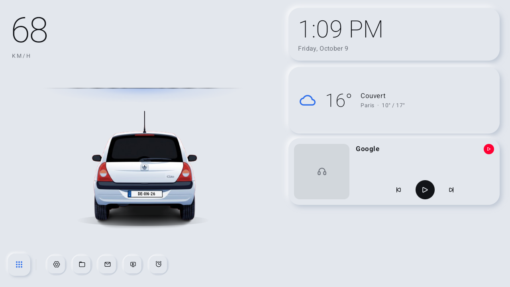
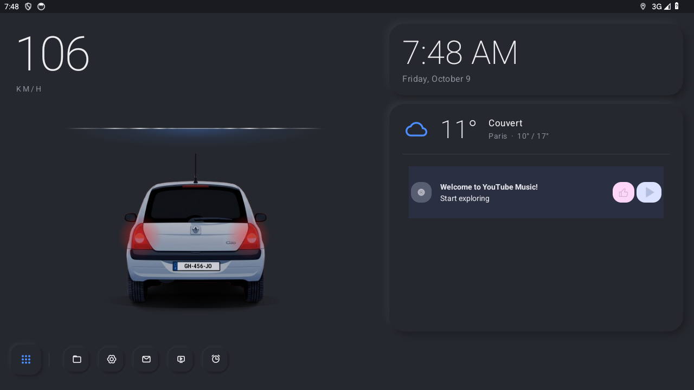
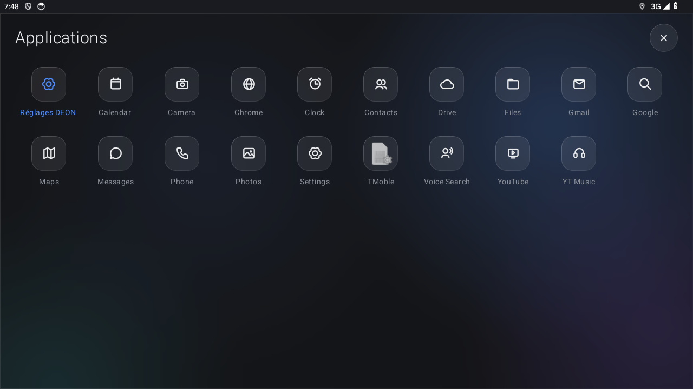
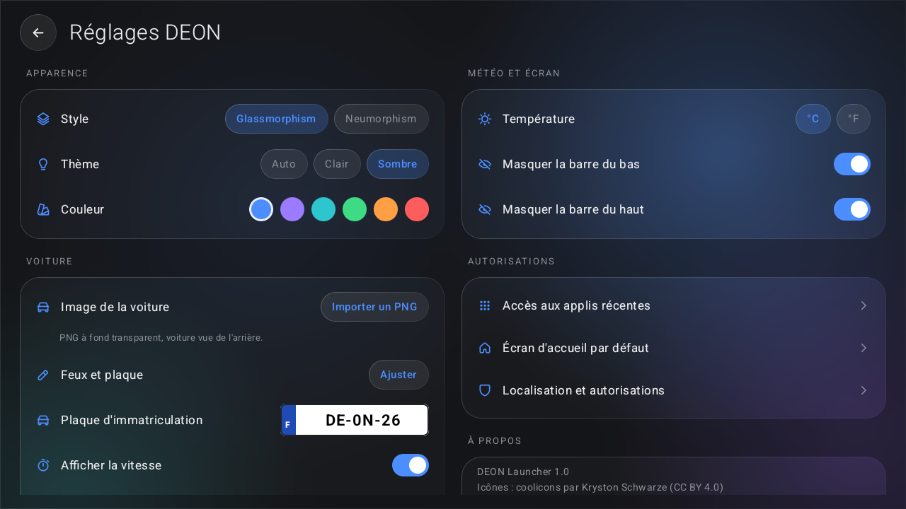
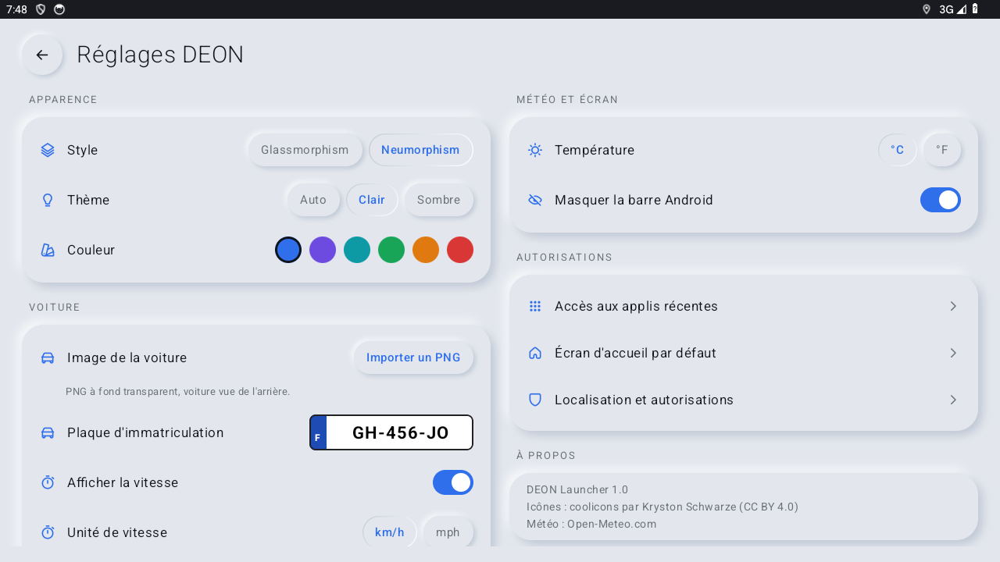
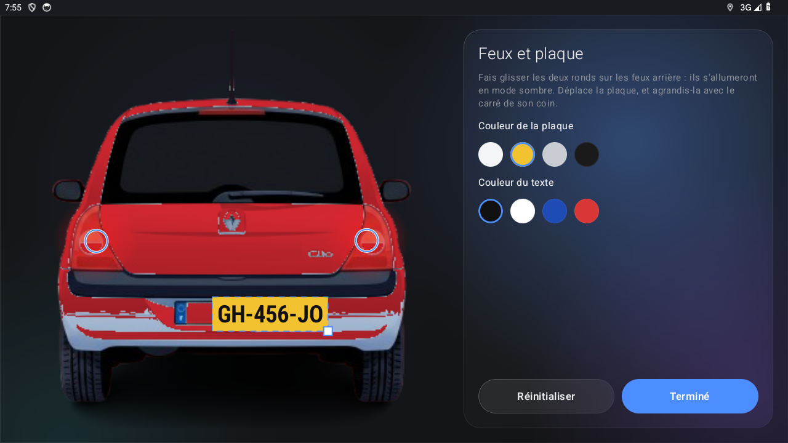

# DEON Launcher

Un launcher Android moderne pour autoradios (Android 10 à 14, écran paysage 1280x720), testé sur l'autoradio **ROCO K706**. Il affiche ta voiture en grand, avec la vitesse GPS, l'heure, la météo et ton lecteur de musique, dans un style glassmorphism ou neumorphism.



| Glassmorphism clair | Neumorphism clair | Neumorphism sombre |
|---|---|---|
|  |  |  |

| Applications | Réglages | Réglages (neumorphism) |
|---|---|---|
|  |  |  |

| Feux et plaque d'une voiture importée |
|---|
|  |

## Fonctionnalités

- **Ta voiture à l'écran**, posée sous une ligne d'horizon lumineuse. Des traits de lumière défilent et la voiture vibre légèrement selon la vitesse GPS.
- **Ta plaque d'immatriculation** affichée sur la voiture.
- **Ta propre voiture** : importe un PNG à fond transparent (vue arrière) depuis les réglages, puis place toi-même les feux arrière (allumés en mode sombre) et la plaque, et choisis la couleur de la plaque et du texte.
- **Vitesse GPS** en km/h ou mph, **heure du système**, **météo** de ta position ([Open-Meteo](https://open-meteo.com), sans compte).
- **Widgets** : n'importe quel widget (lecteur YT Music, Spotify…) s'ajoute ou se retire par appui long sur l'écran.
- **Applis récentes** en bas à gauche, liste complète des applis avec des icônes unifiées.
- **Deux styles** : glassmorphism (verre dépoli) ou neumorphism (relief doux), en clair, sombre ou automatique, avec 6 couleurs d'accent.
- Barre de navigation Android masquable pour un écran épuré.

## Installation

1. Télécharge `DEON-Launcher.apk` depuis la page [Releases](../../releases).
2. Copie-le sur une clé USB, branche-la sur l'autoradio et ouvre le fichier depuis le gestionnaire de fichiers. Autorise l'installation depuis cette source si Android le demande.
3. Appuie sur le bouton Accueil et choisis **DEON Launcher**, ou va dans *Paramètres › Applications › Applications par défaut › Application d'accueil*.
4. Au premier lancement, accepte la localisation (vitesse et météo), puis touche « Activer les applis récentes ».

Sur certains autoradios chinois (FYT, Topway…), le choix du launcher peut être verrouillé dans les réglages d'usine.

## Réglages

Ouvre la liste des applis (bouton en bas à gauche) puis **Réglages DEON** : style, thème, couleur, image de la voiture, plaque, unités, vibrations, barre Android et raccourcis vers les autorisations.

## Compiler soi-même

Prérequis : JDK 17 et le SDK Android (plateforme 34).

```bash
./gradlew assembleDebug
```

L'APK se trouve dans `app/build/outputs/apk/debug/`. Le script `gps-trajet.sh` simule un trajet GPS dans l'émulateur Android pour tester la vitesse.

## Crédits

- Icônes : [coolicons](https://github.com/krystonschwarze/coolicons) par Kryston Schwarze, sous licence [CC BY 4.0](https://creativecommons.org/licenses/by/4.0/).
- Météo : [Open-Meteo.com](https://open-meteo.com), données sous licence CC BY 4.0.

## Licence

Code sous licence MIT, voir [LICENSE](LICENSE).

## Mots clés

launcher autoradio, android car launcher, head unit launcher, ROCO K706, autoradio Android 14, launcher voiture, car stereo launcher, glassmorphism, neumorphism
